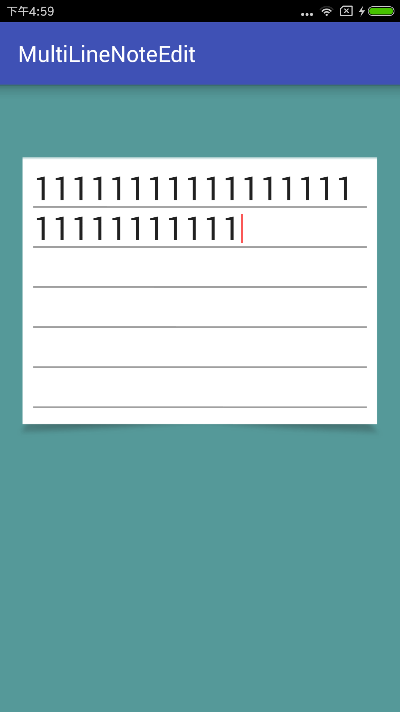

# 多行记事本输入框

* 有笔记本式下划线
* compileSdkVersion 25
* buildToolsVersion "25.0.2"
* minSdkVersion 19
* targetSdkVersion 25

---

* ```io.keyss.multilinenoteedit.MultiLineNoteEditText``` 自定义输入框
* 可以直接在xml里设置最小行数
* 光标高度等于两行之间的高度,所以再怎么调也没用,必须重新画光标```drawable/cursor_drawable.xml```
* 在xml中设置光标```android:textCursorDrawable="@drawable/cursor_drawable"```
* 字体和间距的不同,会导致位置变难看,这个没有办法活动,特别大特别小的,可以自己在类里面调节一下
  * ```lineDis``` 这个变量调线的位置
  * ```cursor_drawable.xml```中的padding调光标的高低,负数是缩短

